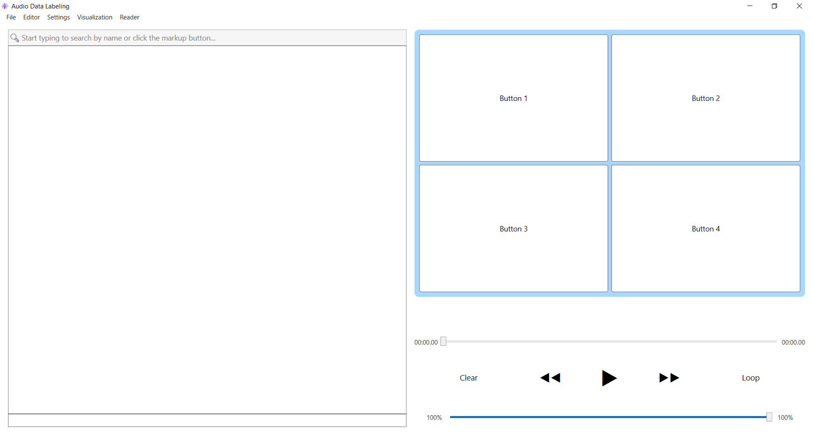

# 🎧 Audio Data Labeling

A WPF desktop application for **manual audio data labeling** — quickly assign categories to audio files, navigate through a playlist, visualize waveforms, and export annotations to JSON Lines format for machine learning datasets.

---



---

## 📖 Overview

**Audio Data Labeling** is a lightweight tool designed to speed up the process of manually categorizing audio files. It is intended for building datasets for audio classification, speech recognition, or any ML task where audio needs to be sorted into categories.

The app plays audio files one by one, lets you assign a label with a single click, and automatically moves to the next track. All annotations are stored in a **JSON Lines (`.jsonl`)** file, ready to be consumed by training pipelines.

---

## ✨ Features

### 🎵 Audio Playback
- Powered by **NAudio** with `WaveOutEvent` output.
- Supports `.mp3`, `.wav`, `.aac`, `.m4a`.
- Custom resampling pipeline (`WdlResamplingSampleProvider`) to a unified `44100 Hz / Stereo` target format.
- Thread-safe stream provider (`SafeTrackStreamProvider`) prevents UI/audio desync.
- Adjustable **audio device**, **latency**, and **volume**.
- **Loop mode** — replay the current track a configurable number of times.

### 🏷️ Fast Labeling Workflow
- Customizable **label buttons** (2–20 buttons) via the built-in **Button Editor**.
- One-click labeling: assigns the category and auto-advances to the next track.
- **Right-click a label button** to filter the playlist by that category.
- `Clear` button to reset the current track's label.
- Progress indicator (green/gray dot) next to each track showing whether it has been labeled.

### 🔍 Search & Filter
- Live filtering of the playlist by **file name** or **assigned label**.
- Placeholder text with focus/blur handling.

### 🌊 Waveform Visualization
- Waveform rendering with two modes:
  - **Single-threaded** — low CPU usage, no UI freezes.
  - **Multi-threaded** — turbo mode for long (hour-long) files.
- Adjustable **playback marker** (red line) synced with the audio position.

### 📊 Analytics & Visualization
- Built-in charts using **LiveCharts2**:
  - 📊 **Bar Chart** — file count per category.
  - 🍕 **Pie Chart** — category distribution.
  - 🕸️ **Polar / Radar Chart** — density visualization.

### 📄 JSON Reader
- Built-in viewer for `.jsonl` files with **live search highlighting**.
- Match counter showing how many records match your query.

### 💾 Saving & Session Restore
- Saves annotations in **JSON Lines** format:
  ```json
  {"AudioFile":"track01.wav","Category":"Speech","Duration":3.42}
  
### ⌨️ Keyboard Shortcuts
```
Shortcut	Action
Ctrl + O	Open folder
Ctrl + S	Save annotations
Ctrl + E	Open Button Editor
Ctrl + N	Open Settings
Ctrl + F	Focus search box
Ctrl + G	Open Visualization
Ctrl + R	Open JSON Reader
Space	        Play / Pause
←	        Previous track
→	        Next track
```

---
## 📜 License
This project is licensed under the MIT License.

---
## 🙏 Acknowledgements
NAudio — audio playback & decoding.

LiveCharts2 — charts & visualization.

SkiaSharp — 2D graphics backend.

## 👤 Author 
AdmiralXMystery